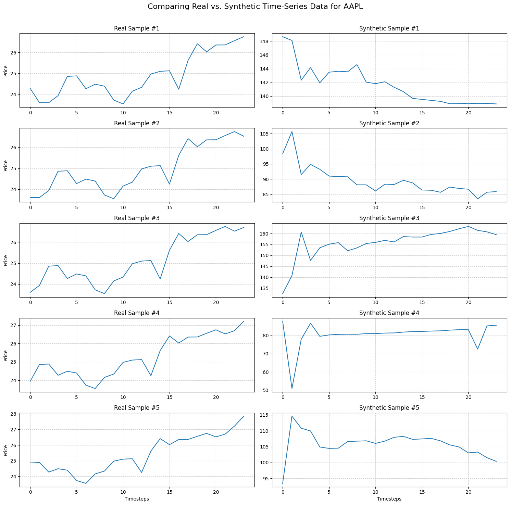

# Generative Market: Synthetic Financial Data with GANs and Transformers

This repository contains my implementation of a sophisticated deep learning framework for generating high-fidelity, synthetic financial time-series data. The primary goal is to leverage Generative Adversarial Networks (GANs) to learn the underlying data generating process of real stock prices. The resulting synthetic data preserves key statistical and temporal characteristics of the original series, making it a valuable tool for augmenting historical datasets for more robust quantitative strategy backtesting, risk management, and academic research.

This project documents the end-to-end process of building, training, and iteratively refining a **TimeGAN** model, including the implementation of the **Wasserstein GAN with Gradient Penalty (WGAN-GP)** framework to overcome common training instabilities.

<p align="center">
  <a href="GAN for TS Generation.pdf"><strong>View the Full Research Paper (PDF)</strong></a>
</p>


---

## Key Features

- **Advanced Generative Model**: A complete implementation of the TimeGAN architecture, specifically designed for sequential data.
- **Stable Training Framework**: Utilizes the WGAN-GP loss function to ensure stable training and prevent common GAN pitfalls like mode collapse.
- **Modular Codebase**: The project is structured into logical, reusable modules for data loading, model definition, and training, following professional software engineering practices.
- **Demonstrable Results**: Successfully generates diverse, realistic synthetic stock price data that qualitatively captures the character of real market movements.
- **Clear Future Roadmap**: Outlines a clear path for future work, including quantitative evaluation and the implementation of Transformer-based models.

---

## Results Showcase

The following plot demonstrates the quality of the final model. It compares five real 24-day price sequences of AAPL stock (left column) against five synthetic sequences generated by the trained TimeGAN (right column). The synthetic data successfully captures the volatility, noise, and short-term trends characteristic of the real market data.




---

## Project Structure

The repository is organized into a main application package and a set of controlling notebooks.

```
generative-finance/
│
├── .venv/                  # Virtual environment directory (ignored by Git)
├── generative_finance/     # The core Python package
│   ├── data_loader.py      # Module for downloading and preprocessing data
│   ├── models.py           # Defines the Encoder, Recovery, Generator, and Discriminator networks
│   └── training.py         # Contains the TimeGANTrainer class with the WGAN-GP logic
│
├── 01_load_and_preprocess_data.ipynb                       # Notebook to download and save data for all tickers
├── 02_train_timegan.ipynb                                  # Initial notebook to train the model and generate results
├── 02_a_train_timegan_gaussian_discriminator.ipynb         # Second notebook with the addition of regularization to the Discrimniator
├── 02_a_train_timegan_gaussian_discriminator.ipynb         # Second notebook with the addition of regularization to the Discrimniator
├── 02_b_train_wgan_gp.ipynb                                # Latest notebook with the alteration to the WGAN-GP model
├── requirements.txt                   # Project dependencies
└── README.md                          # This file
```

---

## Installation and Setup

To run this project, follow these steps to set up the environment.

**1. Clone the Repository**
```bash
git clone [https://github.com/goofygamer/generative-finance.git](https://github.com/goofygamer/GAN-Transformers-Synthetic-Data.git)
cd GAN-Transformers-Synthetic-Data
```

**2. Create and Activate a Virtual Environment**
```bash
# For macOS/Linux
python3 -m venv .venv
source .venv/bin/activate

# For Windows
python -m venv .venv
.venv\Scripts\activate
```

**3. Install Dependencies**
Install all the required packages from the `requirements.txt` file.
```bash
pip install -r requirements.txt
```

---

## Workflow and Usage

The project is designed to be run in a sequence of two notebooks.

### Step 1: Data Preparation

- **File**: `01_load_and_preprocess_data.ipynb`
- **Action**: Run all cells in this notebook.
- **Purpose**: This script uses the `data_loader` module to download historical price data for the 12 target companies, preprocesses it into normalized sequences, and saves the final data arrays and scalers into the `data/processed/` directory. This step only needs to be run once.

### Step 2: Model Training and Generation

- **File**: `02_b_train_wgan_gp.ipynb`
- **Action**: Run all cells in this notebook.
- **Purpose**: This is the main script that:
  1. Loads the pre-processed data for a specified ticker (e.g., AAPL).
  2. Builds the TimeGAN model components using the `models.py` module.
  3. Initializes the `TimeGANTrainer` with the WGAN-GP logic from `training.py`.
  4. Trains the model for the specified number of epochs. Key hyperparameters like `LATENT_DIM`, `EPOCHS`, and `LEARNING_RATES` can be configured in this notebook.
  5. After training, it uses the trained generator to create synthetic data.
  6. Finally, it visualizes the synthetic data alongside real samples for qualitative evaluation.

---

## Future Work and Roadmap

This project serves as a strong foundation for further research and development. The following extensions are planned:

#### 1. Rigorous Quantitative Evaluation

Move beyond visual inspection to quantitatively measure the quality of the synthetic data.

- **Statistical Moments**: Compare the mean, standard deviation, skewness, and kurtosis of the distributions of log-returns between the real and synthetic data.
- **Autocorrelation**: Plot and compare the autocorrelation functions (ACF) to ensure the synthetic data preserves the temporal dependencies of the real series.
- **Train-on-Synthetic, Test-on-Real (TSTR)**: A standard methodology where a simple forecasting model (e.g., ARIMA) or trading rule is trained on the synthetic data and then evaluated on the real, unseen test data. The performance should be comparable to a model trained on real data.

#### 2. Multivariate Time-Series Generation

Extend the model to generate data for a portfolio of assets simultaneously. This would require modifying the model to handle multi-feature input and would be a significant step towards learning the complex cross-correlation structure between assets.

#### 3. Transformer-Based Generative Models

Implement a state-of-the-art Transformer-based architecture for time-series generation.

- **Architecture**: Use a decoder-only Transformer (similar to GPT) to model the sequence distribution autoregressively.
- **Comparison**: Directly compare the performance of the Transformer model against the TimeGAN on both qualitative and quantitative metrics.

#### 4. Conditional Generation

Enhance the model to generate data conditioned on specific market regimes or external factors.

- **Example**: Train the generator to accept a conditioning vector that specifies a market state (e.g., "high-volatility," "bull market") and produce data that reflects that state.

---

## License

This project is licensed under the MIT License. See the `LICENSE` file for details.
